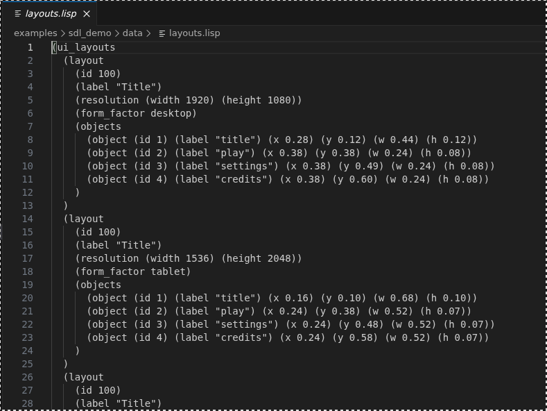

# gsexp

<p>
  
</p>

`gsexp` is a small C++20 S-expression parser/writer helper. It is meant for
simple config and data files used by vendored game libraries.

It parses atoms, strings, and lists into flat parse-owned storage with line/column
diagnostics. It is not a Lisp interpreter. It has no evaluator, macros, schema
system, file search policy, or dependencies outside the C++ standard library.
Numeric atoms are interpreted by helper functions when callers ask for numbers.
Parsed `Node::text()` views are owned by the returned `ParseResult`; keep the
`ParseResult` alive while reading nodes from it.

## Screenshot

<p>
  
</p>

## Target

- `gsexp::gsexp`: parser, tokenizer, value helpers, and string quoting.

## Add To A Project

The intended integration path is vendored source with CMake `add_subdirectory`.
Put `gsexp` under your project, for example:

```text
third_party/
  gsexp/
```

Then wire it into your CMake project:

```cmake
set(GSEXP_BUILD_EXAMPLES OFF CACHE BOOL "" FORCE)
set(GSEXP_BUILD_TESTS OFF CACHE BOOL "" FORCE)
add_subdirectory(third_party/gsexp)

target_link_libraries(my_lib PUBLIC gsexp::gsexp)
```

Libraries that use `gsexp`, such as `glayout`, should link the same
`gsexp::gsexp` target instead of copying parser source into each repo.

## Basic Use

```cpp
const char* text = R"(
(settings
  (name "demo")
  (width 1280)
  (scale 1.5))
)";

gsexp::ParseResult result = gsexp::parse(text);
if (!result.ok) {
    // Print result.diagnostics.
}

gsexp::FormView settings(result.root(0));
std::optional<std::string> name = settings.get_string("name");
std::optional<int> width = settings.get_int("width");
std::optional<float> scale = settings.get_float("scale");

for (gsexp::Node child : settings.node().children()) {
    // Inspect child.type(), child.text(), or child.children().
}
```

Use `parse_owned(std::string)` when the caller already has a loaded source
string and wants to move it into the parse result. Use
`FormView::get_string_view` when the caller can keep the owning `ParseResult`
alive and wants to avoid copying string values. Use `storage_stats()` for
diagnostics or benchmarking; it reports approximate retained storage and is not
intended as an exact heap profiler.

Do not store `Node` handles or `Node::text()` views after the owning
`ParseResult` is destroyed.

`gsexp` does not decide whether a key is valid for your file format. Parse the
tree, then validate it in the owning library or application.

## Build

```sh
./scripts/build.sh
```

The build script also runs the test executable through CTest.

## Run Demo

```sh
./scripts/run.sh
```

## Benchmark

```sh
./scripts/bench.sh
```

Benchmark builds fetch yyjson by default for local JSON comparison. Disable that
with `-DGSEXP_BENCHMARK_YYJSON=OFF` when configuring manually.

Latest recorded comparison on the project test laptop:

| Equivalent case | gsexp | yyjson | yyjson/gsexp |
| --- | ---: | ---: | ---: |
| assets_10k parse | 254.56 MiB/s | 675.40 MiB/s | 2.65x |
| assets_50k parse | 216.99 MiB/s | 645.01 MiB/s | 2.97x |
| asset_database_5k parse | 305.07 MiB/s | 798.06 MiB/s | 2.62x |
| asset_database_20k parse | 311.49 MiB/s | 767.05 MiB/s | 2.46x |
| small_files_1k parse | 215.53 MiB/s | 577.29 MiB/s | 2.68x |
| strings_plain_5k parse | 1073.81 MiB/s | 1318.38 MiB/s | 1.23x |
| strings_escaped_5k parse | 714.02 MiB/s | 1168.21 MiB/s | 1.64x |
| code_forms_2k parse | 270.15 MiB/s | 640.65 MiB/s | 2.37x |
| wide_10k parse | 368.09 MiB/s | 831.31 MiB/s | 2.26x |
| assets_10k lookup | 24.41M queries/s | 53.03M queries/s | 2.17x |
| asset_database_5k lookup | 23.55M queries/s | 55.05M queries/s | 2.34x |
| asset_database_20k lookup | 21.91M queries/s | 50.18M queries/s | 2.29x |
| many_keys_last lookup | 7.58M queries/s | 11.61M queries/s | 1.53x |

These are equivalent generated data shapes, not byte-identical files. The table
is a local development comparison, not a portable claim about every machine.

Benchmark results and optimization notes are kept in
[docs/performance.md](docs/performance.md).

See [docs/spec.md](docs/spec.md) for design boundaries.
